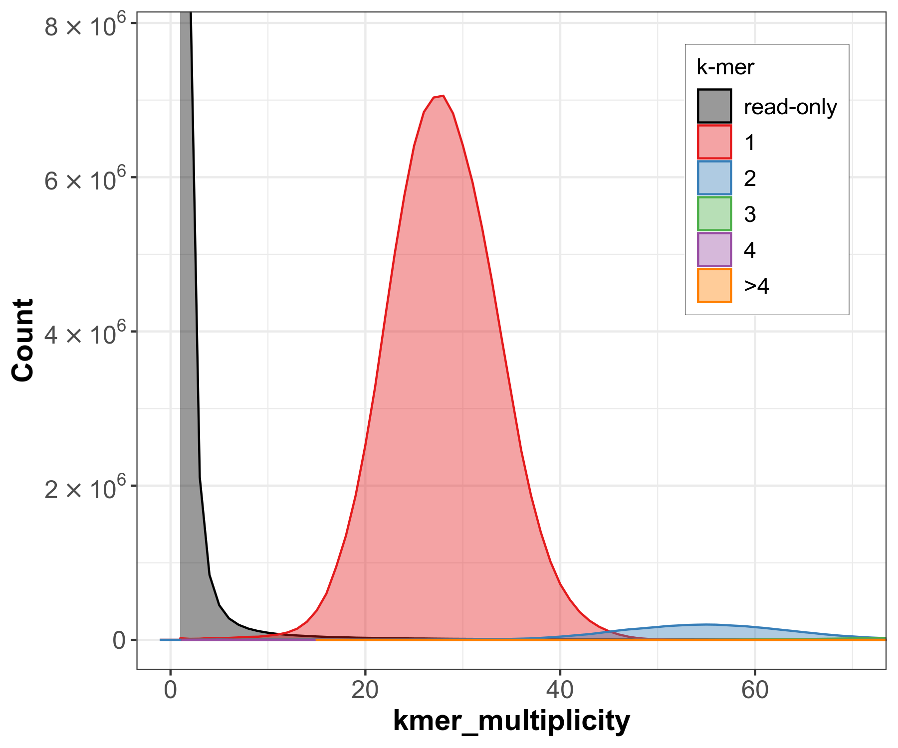
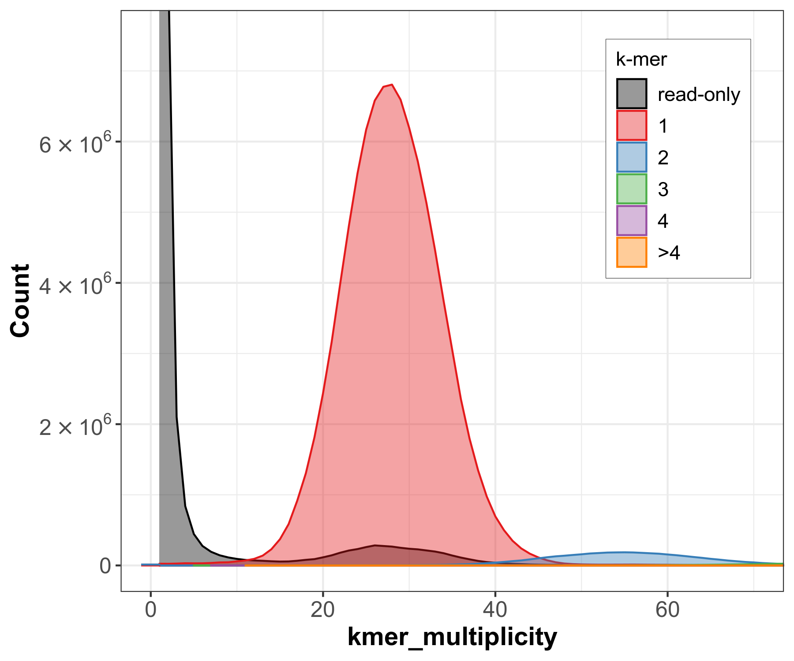
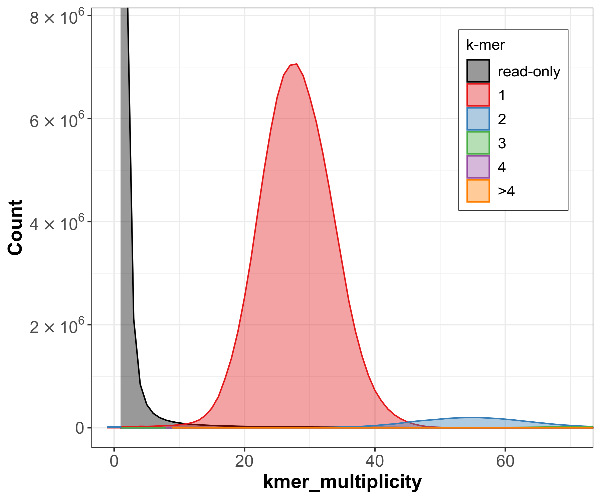
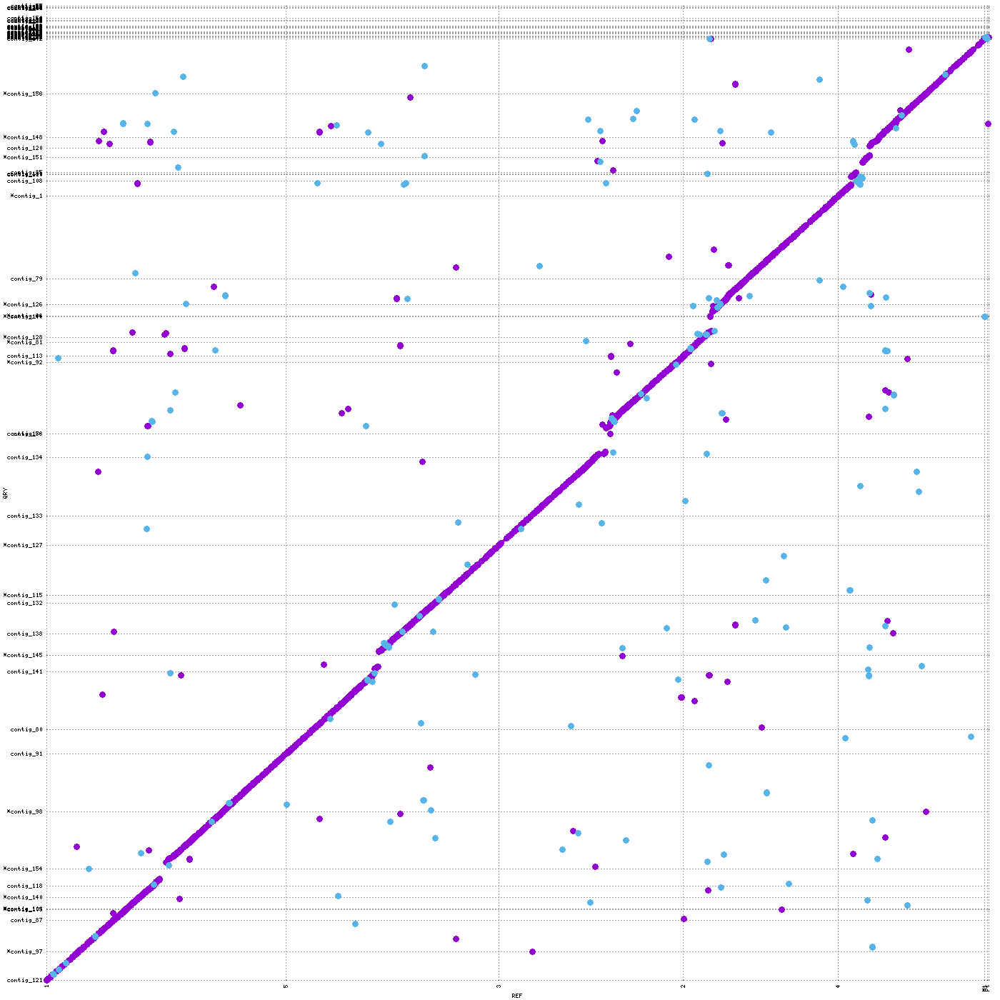
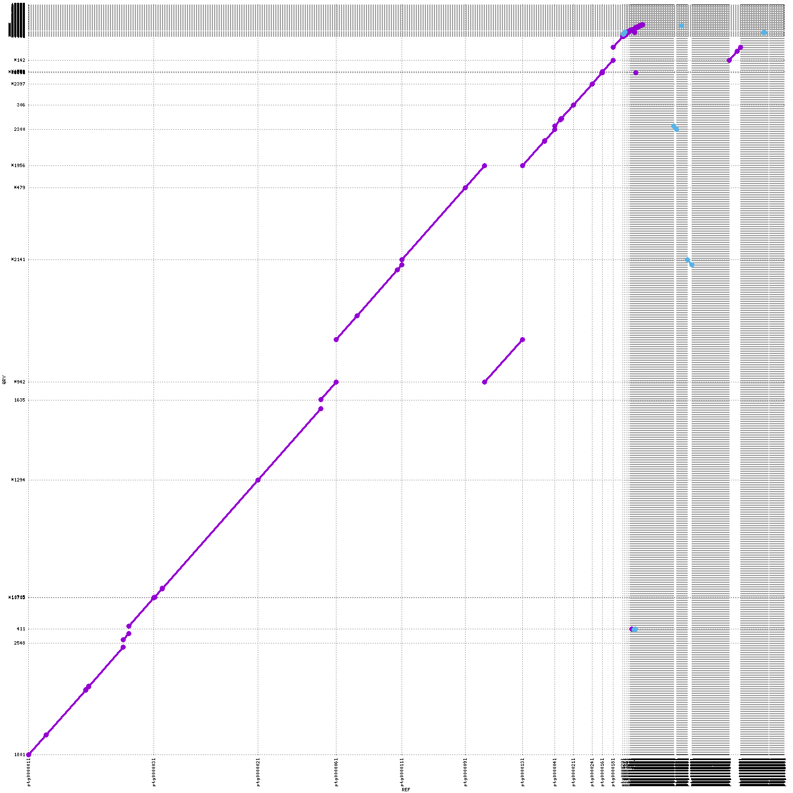

# Genome Assembly and Evaluation

A reproducible workflow for long-read genome assembly, transcriptome assembly, assembly quality assessment, and genome comparison.

This project analyses the *Arabidopsis thaliana* accession **Co-4** using PacBio HiFi whole-genome reads. A shared paired-end RNA-seq dataset from accession Sha is used for transcriptome assembly.

## Data

| Dataset | Sequencing technology | Input |
|---|---|---|
| Co-4 genome | PacBio HiFi | `ERR11437315.fastq.gz` |
| Sha transcriptome | Illumina paired-end RNA-seq | `ERR754081_1.fastq.gz`, `ERR754081_2.fastq.gz` |

Raw sequencing reads and assembled FASTA files are not included because of their size.

## Workflow

1. Read quality assessment with FastQC
2. RNA-seq filtering and trimming with fastp
3. PacBio read statistics with fastp
4. K-mer counting with Jellyfish
5. Genome profiling with GenomeScope 2.0
6. Genome assembly with Flye, Hifiasm, and LJA
7. Transcriptome assembly with Trinity
8. Assembly evaluation with BUSCO
9. Assembly evaluation with QUAST
10. Reference-free evaluation with Merqury
11. Genome comparison with Nucmer and Mummerplot

## Repository structure

```text
.
├── images
│   ├── merqury
│   └── mummer
├── metadata
│   └── software_versions.tsv
├── results
│   ├── busco
│   ├── genomescope
│   ├── merqury
│   └── quast
├── scripts
│   ├── 01_run_fastqc.sh
│   ├── 02_run_fastp_rnaseq.sh
│   ├── 03_run_fastp_hifi.sh
│   ├── 04_count_kmers.sh
│   ├── 05_run_flye.sh
│   ├── 06_run_hifiasm.sh
│   ├── 07_run_lja.sh
│   ├── 08_run_trinity.sh
│   ├── 09_run_busco.sh
│   ├── 10_run_quast_no_reference.sh
│   ├── 11_run_quast_with_reference.sh
│   ├── 12_prepare_meryl_db.sh
│   ├── 13_run_merqury.sh
│   └── 14_run_nucmer_mummerplot.sh
└── README.md
```
## Read quality assessment

FastQC was used to assess the PacBio HiFi and Illumina RNA-seq reads.

| Dataset | Total reads | Read length | GC content |
|---|---:|---:|---:|
| Co-4 PacBio HiFi | 351,347 | 57–40,586 bp | 36% |
| Sha RNA-seq forward | 22,620,680 | 101 bp | 46% |
| Sha RNA-seq reverse | 22,620,680 | 101 bp | 46% |

The PacBio HiFi reads passed the main sequence-quality tests. Their broad length distribution is expected for long-read sequencing. FastQC reported an unusual GC distribution and some overrepresented sequences, but the per-base and per-sequence quality modules passed.

The raw RNA-seq reads showed reduced per-base quality, sequence-content bias, duplication, and overrepresented sequences. Some duplication and sequence bias are expected in RNA-seq because highly expressed transcripts are sequenced multiple times. However, the per-base quality results supported filtering and trimming with fastp.

### RNA-seq filtering

| Metric | Before fastp | After fastp |
|---|---:|---:|
| RNA-seq reads | 45,241,360 | 39,807,212 |
| RNA-seq bases | 4,569,377,360 | 3,995,093,673 |
| Q30 rate | 78.55% | 83.56% |

Fastp removed 5,434,148 RNA-seq reads, corresponding to 12.01% of the input.
Adapter sequences were trimmed from 3,510,455 reads. The Q30 rate increased
from 78.55% to 83.56%, indicating improved read quality after processing.

### PacBio sequencing coverage

Fastp was also run on the PacBio HiFi reads without filtering. The dataset
contained 351,347 reads and 5,784,533,205 bases. Based on the GenomeScope
genome-size estimate of approximately 144.4 Mb, the expected sequencing
coverage was:

`5,784,533,205 / 144,400,000 = approximately 40.1×`

This coverage should be sufficient for assembling the Arabidopsis thaliana
Co-4 genome.

## GenomeScope results

K-mers of length 21 were counted from the PacBio HiFi reads.

| Metric | Estimate |
|---|---:|
| Haploid genome length | 144.30–144.47 Mb |
| K-mer coverage | 13.97× |
| Heterozygosity | 0.0247–0.0883% |
| Unique sequence | approximately 73.2% |
| Read error rate | 0.185% |

The estimated genome size is within the expected range for *A. thaliana*. The low heterozygosity is also expected for a predominantly self-fertilising species.
### Why canonical k-mers were used

Canonical k-mers treat a k-mer and its reverse complement as the same sequence. Jellyfish stores only one representation of each pair. This prevents the two DNA strands from being counted separately, makes the analysis
independent of read orientation, and reduces memory usage. The `-C` option was used for canonical k-mer counting.

## Genome assembly statistics

QUAST results without a reference:

| Assembly | Total length | Contigs | Largest contig | N50 | L50 |
|---|---:|---:|---:|---:|---:|
| Flye | 136.91 Mb | 67 | 11.66 Mb | 6.98 Mb | 8 |
| Hifiasm | 163.45 Mb | 662 | 27.11 Mb | 13.75 Mb | 5 |
| LJA | 142.92 Mb | 457 | 23.33 Mb | 15.23 Mb | 4 |

LJA produced the highest N50 and lowest L50. Flye produced the smallest number of contigs. The LJA assembly length was closest to the GenomeScope genome-size estimate. The Hifiasm primary assembly was substantially longer than the estimated genome size.

## BUSCO assessment

The `brassicales_odb10` lineage containing 4,596 BUSCO groups was used.

| Assembly | Complete | Single-copy | Duplicated | Fragmented | Missing |
|---|---:|---:|---:|---:|---:|
| Flye | 99.9% | 98.9% | 1.0% | 0.1% | 0.0% |
| Hifiasm | 96.1% | 95.2% | 0.9% | 0.1% | 3.8% |
| LJA | 99.8% | 98.9% | 0.9% | 0.1% | 0.1% |
| Trinity | 78.9% | 39.3% | 39.6% | 3.5% | 17.6% |

Flye and LJA were highly complete. Flye had no missing BUSCO groups. The Trinity transcriptome had lower completeness and a high duplicated fraction. This is expected because RNA-seq represents expressed genes and can contain multiple transcript isoforms.

## Reference-based QUAST assessment

Assemblies were compared with the TAIR10 reference genome.

| Metric | Flye | Hifiasm | LJA |
|---|---:|---:|---:|
| Genome fraction (%) | 88.535 | 85.334 | 88.732 |
| Duplication ratio | 1.016 | 1.306 | 1.058 |
| Misassemblies | 563 | 1,080 | 885 |
| NGA50 | 674 kb | 649 kb | 763 kb |
| Mismatches per 100 kb | 793.84 | 637.76 | 759.80 |
| Indels per 100 kb | 129.38 | 115.91 | 125.00 |

TAIR10 represents the Col-0 accession, while the assembled genome is Co-4. Therefore, reference-based differences may include real biological variation and should not automatically be interpreted as assembly errors.

## Merqury assessment

| Assembly | QV | Estimated error rate | K-mer completeness |
|---|---:|---:|---:|
| Flye | 63.446 | 4.52 × 10⁻⁷ | 99.0445% |
| Hifiasm | 53.588 | 4.38 × 10⁻⁶ | 95.6549% |
| LJA | 51.987 | 6.33 × 10⁻⁶ | 99.1166% |

Flye had the highest consensus QV and lowest estimated error rate. LJA had the highest k-mer completeness, although the difference from Flye was small. Overall, Flye provided the best balance between consensus accuracy and completeness.

### Copy-number spectra

| Flye | Hifiasm | LJA |
|---|---|---|
|  |  |  |

The spectra-cn plots showed a dominant copy-number-one peak at approximately 28× k-mer multiplicity. This agrees with the GenomeScope model because the reported haploid k-mer coverage was approximately 13.97× and the homozygous peak was expected near twice this value. Flye and LJA captured most of the reliable read k-mers. Hifiasm contained more read-only k-mers and had lower estimated completeness.


## Genome comparison

Nucmer was used with `--breaklen 1000` and `--mincluster 1000`. Mummerplot was used to compare each assembly with TAIR10 and to compare the assemblies with each other.

### TAIR10 versus Flye



### Hifiasm versus LJA



The long forward-alignment blocks show strong overall agreement between the assemblies and the reference. Scattered and reverse alignments may result from repetitive regions, contig orientation, assembly-specific differences, or biological differences between Co-4 and the Col-0 reference.
In the dotplots, purple alignments represent sequences aligned in the same orientation, while blue alignments represent reverse-orientation matches. Long diagonal blocks indicate agreement and conserved sequence order. Off-diagonal or reverse-orientation blocks may indicate inversions, rearrangements, repetitive matches, contig-orientation differences, or assembly-specific differences.

The Co-4 assemblies showed strong overall agreement with the TAIR10 reference. However, the alignments were not completely continuous. TAIR10 represents the Col-0 accession, while the assembled genome is Co-4. Therefore, some observed differences may represent real biological variation rather than assembly errors.

The three assemblies also showed broad agreement with each other. Flye and LJA provided comparatively consistent representations of the genome. Hifiasm contained more contigs and had a larger total assembly length, suggesting that some alternative haplotypes or duplicated regions may not have been collapsed.

Comparisons among different accessions were performed at the group level and are presented in the group presentation rather than in this accession-specific repository.


## Overall assessment

No assembler performed best for every metric.

- **Flye** produced the fewest contigs, the highest BUSCO completeness, and the highest Merqury QV.
- **LJA** produced the highest N50 and the highest k-mer completeness.
- **Hifiasm** produced the largest contig, but its assembly was longer, more fragmented, and less complete.
- Flye provided the best overall balance between completeness, consensus accuracy, and assembly size for Co-4.

## Reproducibility

The analyses were run on a SLURM cluster using the `pibu_el8` partition. Software was loaded through environment modules or executed in Apptainer containers.

Software versions and container paths are listed in [`metadata/software_versions.tsv`](metadata/software_versions.tsv).

Example job submission:

```bash
sbatch scripts/05_run_flye.sh
```

The scripts contain project-specific input and output paths. These variables can be changed at the beginning of each script when adapting the workflow to another accession or computing environment.
